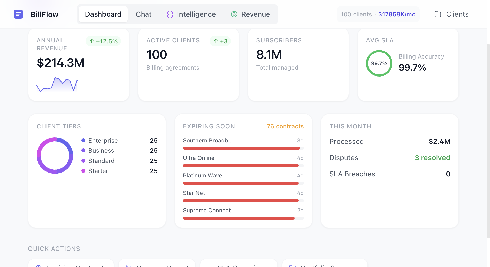
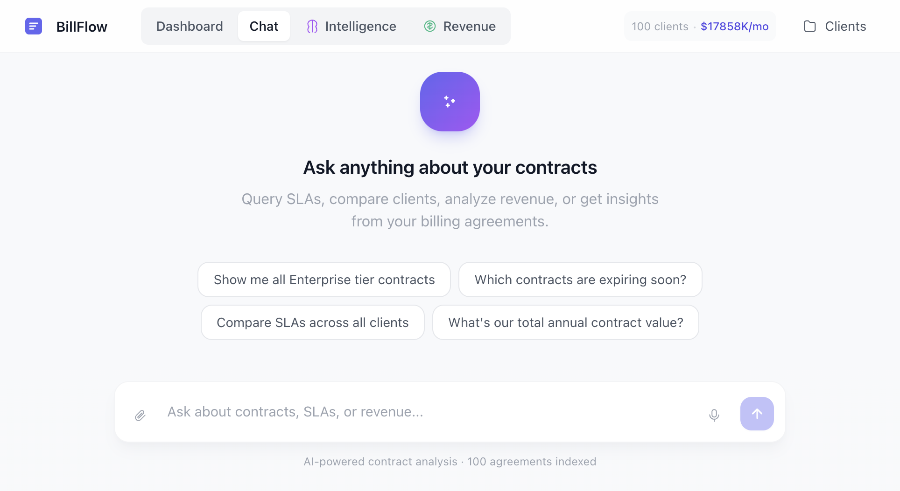
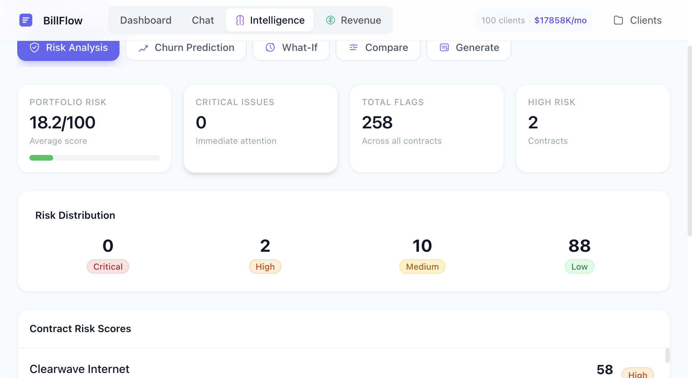

# BillFlow

> AI-powered contract intelligence platform for B2B billing agreements. Built with RAG, GPT-4, and a modern React frontend.



## ✨ Key Features

### 📊 Portfolio Dashboard
Real-time visibility into your entire contract portfolio:
- **$214M+ Annual Revenue** tracked across 100 billing agreements
- **8.1M subscribers** managed with 99.7% SLA accuracy
- Expiring contracts timeline with renewal urgency indicators
- Client tier distribution and monthly processing metrics

### 💬 AI-Powered Contract Q&A


Ask natural language questions about your contracts:
- *"What's the SLA for Sky Digital?"*
- *"Which contracts are expiring soon?"*
- *"Compare pricing across all Enterprise clients"*

Uses **RAG with MMR retrieval** across 60+ document chunks for comprehensive answers with source citations.

### 🧠 Intelligence Suite


- **Risk Scoring** - Automated analysis of 258 risk flags across all contracts
- **Churn Prediction** - ML-based probability scores with recommended actions
- **What-If Scenarios** - Simulate pricing changes, term extensions, tier upgrades
- **Contract Comparison** - Side-by-side diff of any two agreements
- **AI Contract Generation** - Describe terms in plain English, get a contract

### 💰 Revenue Command Center


The experimental (and most impressive) feature:
- **$61.9M Revenue Leakage** detected - pricing gaps, uncollected fees
- **$200.3M Opportunities** identified - upsells, tier upgrades, term extensions
- **62 Active Signals** - early warning system for churn risk
- **AI-Generated Outreach** - one-click email/call scripts for each action

---

## 🛠 Tech Stack

| Layer | Technology |
|-------|------------|
| **Frontend** | React 18, TypeScript, Tailwind CSS, Vite |
| **Backend** | FastAPI, Python 3.12 |
| **AI/ML** | LangChain, GPT-4, text-embedding-3-small |
| **Vector DB** | ChromaDB |
| **LLM Provider** | Azure OpenAI |

## 🚀 Getting Started

### Prerequisites
- Python 3.10+
- Node.js 18+
- Azure OpenAI API access

### Setup

```bash
# Clone and setup Python environment
git clone https://github.com/yourusername/billflow.git
cd billflow
python -m venv venv
source venv/bin/activate
pip install -r requirements.txt

# Configure Azure OpenAI
cp .env.example .env
# Edit .env with your credentials

# Generate sample contracts (or add your own PDFs to /data)
python generate_contracts.py

# Build the vector store
python ingestion.py

# Start the API server
uvicorn backend_api:app --reload --port 8001
```

```bash
# In a new terminal - start the frontend
cd frontend
npm install
npm run dev
```

Open http://localhost:5173

## 📁 Project Structure

```
├── backend_api.py           # FastAPI server with 15+ endpoints
├── rag_chat.py              # RAG chain with MMR retrieval
├── contract_intelligence.py # Risk scoring, churn prediction, what-if
├── revenue_intelligence.py  # Leakage detection, opportunity finding
├── ingestion.py             # PDF/TXT → ChromaDB pipeline
├── config.py                # Azure OpenAI configuration
├── data/                    # 100+ contract files (PDF & TXT)
├── frontend/                # React + TypeScript app
│   └── src/App.tsx          # Single-file 3000+ LOC React app
└── screenshots/             # UI screenshots
```

## 🔌 API Endpoints

| Endpoint | Description |
|----------|-------------|
| `POST /chat` | Natural language contract queries |
| `GET /contracts` | List all contracts with metadata |
| `GET /metrics` | Portfolio-wide KPIs |
| `GET /intelligence/risk` | Risk analysis for all contracts |
| `GET /intelligence/churn` | Churn probability predictions |
| `POST /intelligence/simulate` | What-if scenario modeling |
| `POST /intelligence/compare` | Side-by-side contract diff |
| `POST /intelligence/generate` | AI contract generation |
| `GET /revenue/command-center` | Full revenue intelligence data |
| `POST /revenue/generate-outreach` | AI-generated sales scripts |

## 🧪 How the RAG Works

1. **Ingestion**: Contracts (PDF/TXT) are chunked into ~1500 char pieces
2. **Embedding**: Each chunk embedded with `text-embedding-3-small`
3. **Storage**: Vectors stored in ChromaDB locally
4. **Retrieval**: MMR retrieval fetches top-60 diverse chunks
5. **Generation**: GPT-4 synthesizes answer with source citations

The high k=60 is intentional—comparison questions like *"which client has the best SLA"* need visibility across multiple contracts.

## 📈 Demo Data

The included demo generates:
- **100 billing contracts** with realistic terms
- **$214M total ACV** across 4 client tiers
- **8.1M subscribers** with varied SLAs
- Randomized expiration dates, pricing models, and compliance terms

## ⚠️ Known Limitations

- Revenue signals use simulated data (no real payment integrations yet)
- Contract generation fills templates—not fully generative
- No authentication (demo/prototype mode)

## 🔮 Roadmap Ideas

- [ ] Salesforce/HubSpot CRM sync
- [ ] Slack bot for quick queries
- [ ] Email integration for direct outreach
- [ ] Real payment/usage data ingestion
- [ ] Mobile app with push alerts

---

**Built as a proof-of-concept for AI-powered contract intelligence.** The revenue optimization features demonstrate what's possible when you combine RAG with domain-specific business logic.

[](https://langchain.com)
[](https://fastapi.tiangolo.com)
[](https://reactjs.org)
